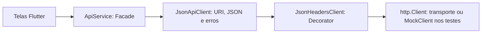

# Aplicação de Decorator e Facade na comunicação HTTP

Questão 2 — Problema 2 — Jornada Verde. Registro de 06 set. 2026.

## 1 Problema identificado

O arquivo `codigo-fonte/lib/services/api_service.dart` repetia a construção de URI, headers, serialização JSON, execução HTTP e interpretação da resposta em suas operações. `listarTurmas` possuía um caminho diferente: decodificava o corpo sem verificar o status HTTP e retornava lista vazia para respostas JSON que não fossem listas, ocultando falhas como se não existissem turmas.

A refatoração preserva a interface pública usada pelas telas e concentra a comunicação em componentes com responsabilidades explícitas. O problema 1 do backend e a pesquisa da questão 1 não foram alterados.

## 2 Responsabilidades antes e depois

| Responsabilidade | Antes | Depois |
| :--- | :--- | :--- |
| Nome da operação, endpoint, verbo e campos de negócio | Cada método de ApiService | ApiService, como fachada |
| Construção de URI e query | Repetida nos métodos | JsonApiClient._request |
| Headers padrão | Cada método passava _jsonHeaders | JsonHeadersClient.send |
| Serialização JSON e identificação do corpo JSON | jsonEncode em cada operação | JsonApiClient._request |
| Envio HTTP | get/post/put/delete espalhados | Um único send, passando pelo decorator |
| Status, decodificação e formato de resposta | _parseResponse ou parsing próprio da listagem | JsonApiClient._request, usado por object e list |
| Erro exposto às telas | ApiException no arquivo da fachada | Arquivo próprio, reexportado pela fachada |
| Encerramento do cliente | Sem método na fachada | close delega até o cliente envolvido |

## 3 Escolha e ajuste do padrão

A sugestão da equipe foi aceita com um ajuste técnico: **Decorator precisa preservar a interface do componente decorado**. No pacote `http`, `Client.post` retorna `Future<Response>`; substituí-lo por um método que retorna um mapa JSON quebraria esse contrato. Além disso, o pacote interpreta um `Map` recebido em `post` como formulário, não como JSON (DART, [s.d.]).

Por isso, `JsonHeadersClient` estende `http.BaseClient`, envolve outro `http.Client` e sobrescreve `send` e `close`. Os métodos de conveniência de BaseClient passam pelo método send, permitindo acrescentar headers em um único ponto (DART, [s.d.]). O decorator não muda corpo, status ou tipo de resposta. Headers explícitos são respeitados; multipart mantém seu Content-Type e boundary.

`JsonApiClient` é a camada que adapta as respostas HTTP para objetos ou listas e concentra URI, JSON e erros. Não se apresenta como implementação de `http.Client`. Para corpos JSON, essa camada informa explicitamente Content-Type, pois `http.Request.body` atribui text/plain por padrão.

`ApiService` continua exercendo o papel de **Facade**, expondo login, cadastro e outras operações às telas. A extração de `_request` é uma técnica de refatoração auxiliar, não o Decorator em si. A aplicação concreta de Decorator é a composição `JsonHeadersClient(inner)` com a mesma interface HTTP.



## 4 Comportamentos preservados e correções intencionais

Foram preservados os nomes e parâmetros dos 16 métodos públicos anteriores, endpoints normais, verbos, campos e bytes dos corpos verificados. `ApiService(client: ...)`, `instance`, `baseUrl` e a importação de `ApiException` por `api_service.dart` continuam disponíveis. A proteção local de buscarPerfil sem sessão também permanece.

Separadamente da mudança estrutural, foram corrigidos:

- Erros HTTP na listagem agora geram ApiException, em vez de parecer uma listagem vazia.
- Respostas 2xx são reconhecidas como sucesso; corpo ausente retorna o objeto/lista vazio correspondente, incluindo exclusão com 204.
- JSON malformado e formatos incompatíveis com a operação geram erro explícito. Status real é mantido em ApiException.
- Respostas de erro não JSON usam mensagem HTTP genérica; os campos `erro`, `message` e `error` mantêm essa ordem de preferência quando contêm texto.
- Queries e IDs de caminho são codificados para evitar que caracteres reservados sejam interpretados como parâmetros ou separadores adicionais.

Falhas de transporte continuam sendo propagadas, sem serem convertidas em sucesso. `close()` permite liberar o cliente; quem cria uma instância para uso temporário pode encerrá-la. Encerrar uma fachada também encerra o cliente injetado, portanto não deve fazê-lo enquanto esse cliente estiver sendo compartilhado por outras operações. A instância global deve permanecer aberta durante seu uso pelo aplicativo.

Não foram implementados autenticação, novos endpoints, configuração de endereço Android, retries, logs ou upload real. `anexarEvidencia` preserva o contrato JSON anterior, cuja incompatibilidade com o multipart exigido pelo backend continua pendente. O teste de multipart demonstra apenas que o decorator não danifica esse formato; não comprova integração do upload do aplicativo.

## 5 Testes e resultados

Teste: `codigo-fonte/test/api_service_test.dart`.

Snapshot anterior: `codigo-fonte/test/fixtures/api_service_antes.dart`, copiado antes da alteração e mantido como referência executável. Ele não é importado pelo aplicativo.

| Grupo | Quantidade | Verificação |
| :--- | :--- | :--- |
| Comparação antes/depois | 16 | Retorno, verbo, URL, bytes do corpo e headers JSON de cada operação |
| Mensagens de erro | 3 | Campos erro, message e error |
| Status e formato | 7 | Erro da listagem, erro não JSON, JSON inválido, objeto/lista incompatível, 201 e 204 |
| Transporte e sessão | 4 | Falha de rede, perfil sem sessão, query com caracteres reservados e listagem sem sessão |
| Decorator e recursos | 3 | Preservação de headers/corpo/resposta, multipart e close |
| **Total** | **33** | **33 aprovados; 0 falhas** |

Os testes executam os serviços Dart reais com MockClient, sem servidor ou banco. Foi usado um ambiente isolado porque Flutter não está instalado na máquina: **Dart 3.13.3, http 1.6.0 e test 1.32.0**. SDK e dependências foram baixados para `work/validacao-api`, ignorado pelo Git; o SDK não foi instalado globalmente. A resolução isolada mapeou `package:jornada_verde` para os arquivos reais em `codigo-fonte`, sem copiar sua implementação.

Análise estática de `codigo-fonte/lib/services`: **No issues found!**

Em ambiente Flutter instalado e configurado, dentro de codigo-fonte, o procedimento de reprodução é:

```sh
flutter pub get
flutter test test/api_service_test.dart
```

Esse comando Flutter é instrução para reprodução; a execução efetivamente realizada nesta sessão foi a do Dart isolado, abaixo, a partir de `work/validacao-api`:

```powershell
.\dart-sdk\bin\dart.exe --packages=.dart_tool/package_config.json pub-cache/hosted/pub.dev/test-1.32.0/bin/test.dart ../../codigo-fonte/test/api_service_test.dart --reporter expanded
```

O package_config desse ambiente é temporário. Para outra máquina, prefira a reprodução com Flutter acima. A dependência `test` foi acrescentada ao pubspec do aplicativo para tornar a suíte disponível após resolução normal das dependências.

Limites: não foram executados testes de widgets, build Android/web ou integração com backend. Os cenários não comprovam cobertura total nem resolução de dependências em uma versão específica do Flutter. A preservação de comportamento refere-se aos cenários comparados; as correções intencionais estão listadas na seção 4.

## 6 Melhoria demonstrada

Os métodos de negócio agora declaram apenas operação, endpoint e dados. A serialização, o envio e a política de erros possuem um ponto de manutenção. A listagem usa o mesmo tratamento HTTP das demais operações. O decorator pode envolver tanto o cliente real quanto um MockClient, mantendo o contrato de transporte.

O custo é a introdução de arquivos auxiliares. Não foi medida redução de latência: o ganho demonstrado é de organização, consistência e testabilidade, sem alegação de melhoria de desempenho.

Este conteúdo complementa o relatório acadêmico da equipe; não é uma declaração de conformidade integral de diagramação ABNT. As referências e o texto devem ser incorporados ao documento final já existente.

## Referências

DART. **BaseClient class**. Pub.dev, [s.d.]. Disponível em: https://pub.dev/documentation/http/latest/http/BaseClient-class.html. Acesso em: 6 set. 2026.

DART. **post method: Client class**. Pub.dev, [s.d.]. Disponível em: https://pub.dev/documentation/http/latest/http/Client/post.html. Acesso em: 6 set. 2026.

## Apêndice A — Comparação de código

Os exemplos seguintes foram extraídos do snapshot e dos arquivos refatorados do projeto.

### A.1 Antes: criar e excluir turma

```dart
  Future<Map<String, dynamic>> criarTurma({required String nome}) async {
    final response = await _client.post(
      Uri.parse('$baseUrl/turmas'),
      headers: _jsonHeaders,
      body: jsonEncode({
        'nome': nome,
        'professorId': UsuarioSession.id,
      }),
    );
    return _parseResponse(response);
  }

  Future<Map<String, dynamic>> excluirTurma({required String turmaId}) async {
    final response = await _client.delete(
      Uri.parse('$baseUrl/turmas/$turmaId'),
      headers: _jsonHeaders,
    );
    return _parseResponse(response);
  }
```

### Depois: codigo-fonte/lib/services/api_service.dart

```dart
import 'package:http/http.dart' as http;

import 'api_exception.dart';
import 'json_api_client.dart';
import 'usuario_session.dart';

// Preserva os imports existentes das telas que utilizam ApiException.
export 'api_exception.dart';

/// Facade: expõe operações do aplicativo e esconde o transporte HTTP.
class ApiService {
  ApiService({http.Client? client})
    : _api = JsonApiClient(baseUrl: baseUrl, client: client ?? http.Client());
  final JsonApiClient _api;
  static const String baseUrl = 'http://localhost:3000/api';
  static final ApiService instance = ApiService();

  Future<Map<String, dynamic>> login(String email, String password) => _api
      .object('POST', '/auth/login', body: {'email': email, 'senha': password});

  Future<Map<String, dynamic>> cadastrarUsuario({
    required String name,
    required String email,
    required String password,
    required String role,
    String? classCode,
  }) => _api.object(
    'POST',
    '/auth/register',
    body: {
      'nome': name,
      'email': email,
      'senha': password,
      'role': role,
      'codigoTurma': classCode,
    },
  );

  Future<Map<String, dynamic>> buscarPreferenciasAcessibilidade() =>
      _api.object(
        'GET',
        '/usuario/preferencias',
        query: {'id': '${UsuarioSession.id}'},
      );

  Future<Map<String, dynamic>> recuperarSenha({required String email}) =>
      _api.object('POST', '/auth/forgot-password', body: {'email': email});

  Future<Map<String, dynamic>> lancarDesafio({
    required String title,
    required String description,
    required int points,
    required DateTime deadline,
  }) => _api.object(
    'POST',
    '/desafios',
    body: {
      'titulo': title,
      'descricao': description,
      'pontuacao': points,
      'prazoLimite': deadline.toIso8601String(),
    },
  );

  // Mantém o contrato anterior; upload multipart é uma correção separada.
  Future<Map<String, dynamic>> anexarEvidencia({
    required String desafioId,
    required String arquivoNome,
  }) => _api.object(
    'POST',
    '/desafios/${Uri.encodeComponent(desafioId)}/evidencias',
    body: {'arquivoNome': arquivoNome},
  );

  Future<List<dynamic>> listarTurmas() => _api.list(
    '/turmas',
    query: UsuarioSession.id == null
        ? null
        : {'professorId': UsuarioSession.id!},
  );

  Future<Map<String, dynamic>> criarTurma({required String nome}) =>
      _api.object(
        'POST',
        '/turmas',
        body: {'nome': nome, 'professorId': UsuarioSession.id},
      );

  Future<Map<String, dynamic>> excluirTurma({required String turmaId}) =>
      _api.object('DELETE', '/turmas/${Uri.encodeComponent(turmaId)}');

  Future<Map<String, dynamic>> aprovarEvidencia(String evidenciaId) =>
      _api.object(
        'POST',
        '/evidencias/${Uri.encodeComponent(evidenciaId)}/aprovar',
      );

  Future<Map<String, dynamic>> recusarEvidencia(
    String evidenciaId,
    String justification,
  ) => _api.object(
    'POST',
    '/evidencias/${Uri.encodeComponent(evidenciaId)}/recusar',
    body: {'justificativa': justification},
  );

  Future<Map<String, dynamic>> salvarPreferenciasAcessibilidade({
    required bool modoEscuro,
    required bool modoDaltonismo,
    required double tamanhoFonte,
  }) => _api.object(
    'PUT',
    '/usuario/preferencias',
    query: {'id': '${UsuarioSession.id}'},
    body: {
      'modoEscuro': modoEscuro,
      'modoDaltonismo': modoDaltonismo,
      'tamanhoFonte': tamanhoFonte,
    },
  );

  Future<Map<String, dynamic>> iniciarQuiz({required String quizId}) =>
      _api.object('POST', '/quiz/${Uri.encodeComponent(quizId)}/iniciar');

  Future<Map<String, dynamic>> listarConteudosAprendizado() =>
      _api.object('GET', '/aprender/conteudos');

  Future<Map<String, dynamic>> buscarPerfil() async {
    final userId = UsuarioSession.id;
    if (userId == null) {
      throw ApiException(
        statusCode: 401,
        message: 'Nenhum usuário logado. Faça login novamente.',
      );
    }
    return _api.object('GET', '/usuario/perfil', query: {'id': userId});
  }

  Future<Map<String, dynamic>> buscarRanking({required String turmaId}) =>
      _api.object(
        'GET',
        '/turmas/${Uri.encodeComponent(turmaId)}/ranking',
        query: UsuarioSession.id == null
            ? null
            : {'alunoId': UsuarioSession.id!},
      );

  void close() => _api.close();
}
```

### Depois: codigo-fonte/lib/services/json_headers_client.dart

```dart
import 'package:http/http.dart' as http;

/// Decorator: acrescenta headers sem alterar o contrato de http.Client.
class JsonHeadersClient extends http.BaseClient {
  JsonHeadersClient(this._inner);
  final http.Client _inner;

  @override
  Future<http.StreamedResponse> send(http.BaseRequest request) {
    request.headers.putIfAbsent('Accept', () => 'application/json');
    // Multipart deve controlar seu próprio Content-Type e boundary.
    if (request is http.Request) {
      request.headers.putIfAbsent('Content-Type', () => 'application/json');
    }
    return _inner.send(request);
  }

  @override
  void close() => _inner.close();
}
```

### Depois: codigo-fonte/lib/services/json_api_client.dart

```dart
import 'dart:convert';

import 'package:http/http.dart' as http;

import 'api_exception.dart';
import 'json_headers_client.dart';

/// Adapta HTTP para JSON; não altera o contrato do cliente HTTP decorado.
class JsonApiClient {
  JsonApiClient({required String baseUrl, required http.Client client})
    : _baseUrl = baseUrl,
      _client = JsonHeadersClient(client);
  final String _baseUrl;
  final http.Client _client;

  Future<T> _request<T>(
    String method,
    String endpoint,
    T empty, {
    Map<String, dynamic>? body,
    Map<String, String>? query,
  }) async {
    final uri = Uri.parse('$_baseUrl$endpoint').replace(queryParameters: query);
    final request = http.Request(method, uri);
    if (body != null) {
      request.encoding = utf8;
      request.body = jsonEncode(body);
      // O produtor do JSON substitui o text/plain definido por Request.body.
      request.headers['Content-Type'] = 'application/json; charset=utf-8';
    }
    final response = await http.Response.fromStream(
      await _client.send(request),
    );
    final success = response.statusCode >= 200 && response.statusCode < 300;
    dynamic decoded;
    try {
      if (response.body.isNotEmpty) decoded = jsonDecode(response.body);
    } on FormatException {
      throw ApiException(
        statusCode: response.statusCode,
        message: success
            ? 'Resposta inválida da API: JSON esperado.'
            : 'Erro HTTP ${response.statusCode}',
      );
    }
    if (!success) {
      String? message;
      if (decoded is Map<String, dynamic>) {
        for (final key in ['erro', 'message', 'error']) {
          if (decoded[key] is String) {
            message = decoded[key] as String;
            break;
          }
        }
      }
      throw ApiException(
        statusCode: response.statusCode,
        message: message ?? 'Erro HTTP ${response.statusCode}',
      );
    }
    if (decoded == null) return empty;
    if (decoded is T) return decoded;
    throw ApiException(
      statusCode: response.statusCode,
      message:
          'Resposta inválida da API: ${empty is List ? 'lista' : 'objeto'} esperado.',
    );
  }

  Future<Map<String, dynamic>> object(
    String method,
    String endpoint, {
    Map<String, dynamic>? body,
    Map<String, String>? query,
  }) => _request<Map<String, dynamic>>(
    method,
    endpoint,
    {},
    body: body,
    query: query,
  );

  Future<List<dynamic>> list(String endpoint, {Map<String, String>? query}) =>
      _request<List<dynamic>>('GET', endpoint, [], query: query);

  void close() => _client.close();
}
```
