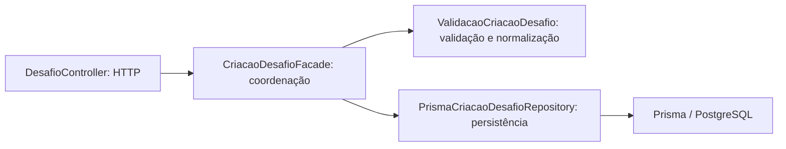

# Aplicação do padrão Facade na criação de desafios

Registro da questão 2 — 06 set. 2026.

## 1 Introdução e delimitação

Este registro apresenta a aplicação de um padrão de projeto ao código do Jornada Verde, complementando a pesquisa da questão 1 já realizada pela equipe. O problema selecionado é o acúmulo de responsabilidades no método `criar` de `backend/src/controllers/DesafioController.ts`.

O segundo problema relatado, repetição nas chamadas de `codigo-fonte/lib/services/api_service.dart`, foi confirmado, mas não foi alterado nesta entrega. Seu tratamento pode envolver centralização do transporte HTTP; extrair um método auxiliar, por si só, não caracteriza automaticamente um padrão GoF.

Este arquivo é conteúdo técnico para incorporação ao trabalho acadêmico existente. Não constitui, isoladamente, um documento diagramado e verificado conforme todas as exigências ABNT da instituição. A questão 1 e as decisões sobre público/B2B não foram modificadas.

## 2 Problema e responsabilidades identificadas

Antes da intervenção, o controller extraía campos da requisição, verificava campos obrigatórios e prazo, normalizava dados, chamava diretamente Prisma e construía respostas HTTP. A gravação de desafios já existia; o problema selecionado era estrutural, não a ausência dessa funcionalidade.

| Responsabilidade | Antes | Depois |
| :--- | :--- | :--- |
| Receber dados e responder HTTP | Controller | Controller |
| Coordenar criação | Controller | `CriacaoDesafioFacade` |
| Validar campos e prazo; normalizar dados | Controller | `ValidacaoCriacaoDesafio` |
| Gravar usando Prisma | Controller | `PrismaCriacaoDesafioRepository` |
| Fornecer horário atual | Controller | Relógio injetável na fachada, com horário real como padrão |

## 3 Padrão escolhido e justificativa

Foi escolhido o padrão estrutural **Facade (Fachada)**. Sua finalidade é oferecer uma interface simplificada para um conjunto de classes de um subsistema (REFACTORING.GURU, [s.d.]). Neste caso, `criar(entrada)` oferece ao controller um único ponto de entrada para validação, preparação e persistência.

A fachada delega trabalho aos colaboradores; não apenas transfere a antiga função inteira para outra classe. O repositório e a injeção de dependências são mecanismos auxiliares à separação de responsabilidades, e não outros padrões da lista exigidos como objeto desta entrega.

Factory Method não foi selecionado porque o problema não apresenta uma hierarquia de criadores com diferentes produtos. Singleton não separaria responsabilidades, e Observer introduziria eventos sem necessidade demonstrada. Uma camada de serviço simples também poderia atender a este pequeno caso de uso; a fachada foi escolhida para explicitar sua interface de entrada e a coordenação dos colaboradores. O custo é acrescentar três arquivos e uma interface ao projeto.



## 4 Preservação de comportamento

Foram preservados os nomes dos campos, remoção de espaços nas extremidades de título e descrição, conversão da pontuação por `Number`, prazo mínimo de 60 segundos, resposta 201 de sucesso e respostas 400 com as mensagens existentes.

O controller ainda usa Prisma em outros métodos, que estão fora desta refatoração. Somente sua operação de criação passou a utilizar a fachada. Nenhuma migração ou gravação em banco foi executada.

As lacunas preexistentes de validação explícita de data inválida, pontuação e tipos recebidos permanecem como trabalho posterior. As interfaces TypeScript não validam JSON em tempo de execução. A mensagem de sucesso anterior também foi preservada, embora a integração do aluno ainda esteja incompleta; a refatoração não entrega esse fluxo.

## 5 Testes e resultados

Arquivo executável: `backend/tests/criacao-desafio.test.cjs`.

O snapshot em `backend/tests/fixtures/DesafioController.antes.txt` preserva o controller anterior à alteração para comparação. Os testes carregam os arquivos TypeScript reais e substituem a fronteira Prisma por um colaborador em memória, sem acessar PostgreSQL ou Redis. Express não é iniciado: os objetos de requisição e resposta são simulados. A remoção dos tipos e o carregamento de módulos usam APIs experimentais do Node, explicitamente habilitadas pelo comando abaixo.

| Grupo | Cenários | Resultado |
| :--- | :--- | :--- |
| Comparação do contrato do controller antes/depois | Sucesso com normalização, título vazio, descrição vazia, prazo passado e falha de persistência | 5 aprovados |
| Limite de prazo com relógio fixo | -1 ms, 0 ms, 59.999 ms e 60.000 ms | 4 aprovados |
| Falha do repositório na fachada | Propagação do erro sem repetição da gravação | 1 aprovado |

Execução em Node **v24.19.0**: **10 testes aprovados, 0 falhas**. As comparações incluem status, conteúdo da resposta e dados encaminhados à persistência. Os casos de validação também verificam que nenhuma gravação ocorre quando a entrada é recusada.

Na raiz do repositório:

```sh
node --experimental-vm-modules --test backend/tests/criacao-desafio.test.cjs
```

Ou, com npm disponível, dentro de `backend`:

```sh
npm run test:criacao
```

Limites: os testes demonstram comportamento do controller e dos colaboradores com persistência simulada. Não comprovam integração com banco real, tráfego HTTP real, funcionamento Flutter ou compilação completa do backend. As dependências do backend não estavam instaladas nesta sessão; não foi executada a verificação completa de tipos. Não se afirma cobertura total do projeto.

## 6 Melhoria demonstrada

A validação pode ser exercitada sem requisição HTTP; a persistência pode ser substituída sem alterar as regras; o relógio fixo permite testar exatamente a fronteira de 60 segundos. Mudanças no armazenamento ficam no repositório, e mudanças de regras ficam na validação. O controller expressa o caso de uso por uma chamada, mantendo a construção de respostas em sua camada.

Não foi medida melhoria de desempenho. O benefício demonstrado é a separação de responsabilidades e a possibilidade de testar as partes isoladamente, mantendo o contrato nos cenários verificados.

## Referências

REFACTORING.GURU. **Facade**. [S. l.], [s.d.]. Disponível em: https://refactoring.guru/design-patterns/facade. Acesso em: 6 set. 2026.

## Apêndice A — Código antes e depois

Os trechos abaixo são extraídos do snapshot e dos arquivos refatorados do próprio projeto.

### A.1 Controller antes

```typescript
  async criar(req: Request, res: Response): Promise<Response> {
    try {
      const { titulo, descricao, pontuacao, prazoLimite } = req.body;

      if (!titulo || titulo.trim() === '' || !descricao || descricao.trim() === '') {
        return res.status(400).json({ error: 'Erro: Campos obrigatórios vazios.' });
      }

      const agora = new Date();
      const prazo = new Date(prazoLimite);

      if (prazo < agora) {
        return res.status(400).json({ error: 'Erro: Prazo no passado.' });
      }

      if (Math.abs(prazo.getTime() - agora.getTime()) < 60000) {
        return res.status(400).json({ error: 'Erro: Prazo precisa dar um tempo mínimo útil de duração.' });
      }

      const novoDesafio = await prisma.desafio.create({
        data: {
          titulo: titulo.trim(),
          descricao: descricao.trim(),
          pontuacao: Number(pontuacao),
          prazoLimite: prazo,
        },
      });

      return res.status(201).json({
        message: 'Desafio cadastrado com sucesso e fica disponível para os alunos da turma.',
        desafio: novoDesafio
      });
    } catch (error: any) {
      return res.status(400).json({ error: error.message });
    }
  }
```

### A.2 Controller depois

```typescript
  async criar(req: Request, res: Response): Promise<Response> {
    try {
      const { titulo, descricao, pontuacao, prazoLimite } = req.body;

      const novoDesafio = await this.criacao.criar({ titulo, descricao, pontuacao, prazoLimite });

      return res.status(201).json({
        message: 'Desafio cadastrado com sucesso e fica disponível para os alunos da turma.',
        desafio: novoDesafio
      });
    } catch (error: any) {
      return res.status(400).json({ error: error.message });
    }
  }
```

### backend/src/services/CriacaoDesafioFacade.ts

```typescript
import { ValidacaoCriacaoDesafio } from './ValidacaoCriacaoDesafio';
import type { DadosNovoDesafio, EntradaCriacaoDesafio } from './ValidacaoCriacaoDesafio';

export interface RepositorioCriacaoDesafio<T> {
  criar(dados: DadosNovoDesafio): Promise<T>;
}

// Ponto de entrada para o subsistema de criação: valida antes de persistir.
export class CriacaoDesafioFacade<T> {
  private readonly repositorio: RepositorioCriacaoDesafio<T>;
  private readonly validacao: ValidacaoCriacaoDesafio;
  private readonly agora: () => Date;

  constructor(
    repositorio: RepositorioCriacaoDesafio<T>,
    validacao = new ValidacaoCriacaoDesafio(),
    agora: () => Date = () => new Date(),
  ) {
    this.repositorio = repositorio;
    this.validacao = validacao;
    this.agora = agora;
  }

  async criar(entrada: EntradaCriacaoDesafio): Promise<T> {
    const dados = this.validacao.preparar(entrada, this.agora());
    return this.repositorio.criar(dados);
  }
}
```

### backend/src/services/ValidacaoCriacaoDesafio.ts

```typescript
export interface EntradaCriacaoDesafio {
  titulo: string;
  descricao: string;
  pontuacao: number | string;
  prazoLimite: string;
}

export interface DadosNovoDesafio {
  titulo: string;
  descricao: string;
  pontuacao: number;
  prazoLimite: Date;
}

export class ValidacaoCriacaoDesafio {
  preparar(entrada: EntradaCriacaoDesafio, agora: Date): DadosNovoDesafio {
    const { titulo, descricao, pontuacao, prazoLimite } = entrada;
    if (!titulo || titulo.trim() === '' || !descricao || descricao.trim() === '') {
      throw new Error('Erro: Campos obrigatórios vazios.');
    }

    const prazo = new Date(prazoLimite);
    if (prazo < agora) {
      throw new Error('Erro: Prazo no passado.');
    }
    if (Math.abs(prazo.getTime() - agora.getTime()) < 60000) {
      throw new Error('Erro: Prazo precisa dar um tempo mínimo útil de duração.');
    }

    return {
      titulo: titulo.trim(),
      descricao: descricao.trim(),
      pontuacao: Number(pontuacao),
      prazoLimite: prazo,
    };
  }
}
```

### backend/src/repositories/PrismaCriacaoDesafioRepository.ts

```typescript
import { prisma } from '../../database/prismaClient';
import type { DadosNovoDesafio } from '../services/ValidacaoCriacaoDesafio';

export class PrismaCriacaoDesafioRepository {
  criar(dados: DadosNovoDesafio) {
    return prisma.desafio.create({ data: dados });
  }
}
```
