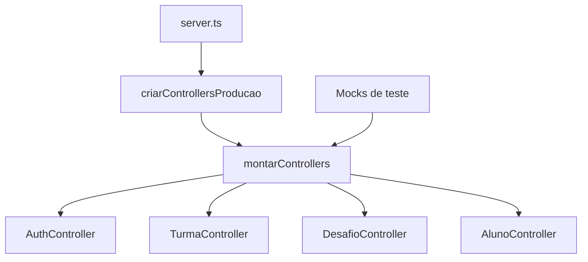

# Problema 3 — Padronização da criação e injeção de dependências

Complemento da questão 2. Jornada Verde, 06 set. 2026.

## 1 Problema e análise das responsabilidades

Os controllers obtinham dependências por criação em atributo, criação no escopo do módulo ou importação de uma instância global. Essa mistura acoplava o tratamento HTTP à montagem dos serviços e dificultava substituir colaboradores em testes. Após a refatoração do problema 1, DesafioController também construía diretamente sua fachada e seu repositório.

O levantamento mencionava que AlunoController e TurmaController deveriam compartilhar TurmaService. A inspeção mostrou um defeito adicional: o primeiro chamava `buscarRanking`, método inexistente nesse serviço. Sua dependência correta é RankingService, que oferece `buscarTop5`. Portanto, não foi preservada uma dependência incorreta apenas para compartilhar a mesma instância.

| Responsabilidade | Destino após a alteração |
| :--- | :--- |
| Construir implementações reais e definir seu uso | `src/composition/producao.ts` |
| Conectar dependências aos controllers | `src/composition/controllers.ts` |
| Receber colaboradores e tratar HTTP | Construtores e métodos dos controllers |
| Registrar URLs e delegar requisições | `server.ts`, com callbacks que preservam o receptor dos métodos |
| Criar usuários Aluno/Professor | Criadores do problema 4, injetados em CadastroService |

## 2 Distinção entre padrões e técnicas

**A solução deste problema é injeção de dependências por construtor com um ponto de composição.** Ela separa configuração de uso, conforme a discussão de Fowler (2004). Uma função que apenas reúne chamadas de `new` não constitui automaticamente Factory Method GoF.

Factory Method exige um contrato de criação cuja implementação possa variar nas subclasses criadoras. Ele foi aplicado explicitamente no problema 4, à criação de produtos Aluno e Professor. Criar uma hierarquia artificial de fábricas de controllers apenas para usar esse nome acrescentaria complexidade sem necessidade demonstrada.

Assim, a sugestão da equipe foi aproveitada quanto à centralização e à possibilidade de usar mocks, mas sua classificação foi corrigida. Caso seja exigido um dos nove padrões GoF para cada problema individualmente, este item deve ser apresentado como técnica complementar ao Factory Method do problema 4, e não rotulado incorretamente.

## 3 Implementação

AuthController recebe operações de cadastro/login. TurmaController foi convertido de funções exportadas para uma classe que recebe as operações de turmas. AlunoController recebe a operação de ranking. DesafioController recebe a fachada existente, o serviço de avaliação e a dependência de persistência utilizada pelos demais métodos.

Os imports dos tipos de serviço nos controllers são `import type`, eliminados em execução. Não é preciso inicializar Prisma, Redis ou bcrypt para instanciar esses controllers com mocks. Os contratos usam projeções de tipos (`Pick`) para limitar os métodos exigidos, embora ainda referenciem tipos da implementação; não se afirma desacoplamento absoluto do modelo Prisma.

As funções de evidências antes exportadas isoladamente passaram a ser métodos de DesafioController. As rotas foram atualizadas no servidor para chamar os métodos na instância composta. Não foram criadas novas URLs.

`criarControllersProducao` é chamado uma vez na inicialização. Os controllers reutilizam seus serviços enquanto essa aplicação está ativa; não há criação por requisição. Isso é uma política de ciclo de vida, não a aplicação do padrão Singleton às classes. O ranking reutiliza a instância já existente, também usada pelo RankingController legado. A instância exportada de TurmaService foi removida depois de verificar seus consumidores.



Limites: RankingController, UsuarioController e PreferenciasController não foram refatorados nesta tarefa. AlunoController permanece sem rota registrada; seus métodos de perfil e envio continuam placeholders preexistentes, identificados em comentários. A correção de sua dependência de ranking não transforma esses placeholders em funcionalidades reais.

## 4 Testes e evidências

Foram testados a substituição por mocks, o mapeamento de role no cadastro, a propagação de erro de autenticação, a validação e delegação de turmas, o ranking no serviço correto, a fachada e a avaliação de desafios, além dos métodos de evidência movidos para a classe.

Também foram criadas duas composições independentes com colaboradores diferentes para verificar ausência de interferência entre seus controllers. Um teste carrega `server.ts` com Express simulado, verifica o registro das rotas migradas e executa seus callbacks sem abrir portas reais.

Resultado conjunto dos problemas 3 e 4 com a regressão do problema 1: **37 testes aprovados, 0 falhas**. A suíte contém 10 testes anteriores de criação de desafios e 27 testes novos. Os testes anteriores foram adaptados para fornecer a fachada pelo construtor, mantendo suas comparações e verificações.

Execução na raiz:

```sh
node --experimental-vm-modules --test backend/tests/criacao-desafio.test.cjs backend/tests/dependencias-cadastro.test.cjs
```

Com npm disponível, dentro de backend:

```sh
npm run test:dependencias-cadastro
```

O carregador de testes usa APIs experimentais do Node para executar TypeScript com tipos removidos e substituir módulos externos somente nos cenários de comparação/registro do servidor. Os testes de injeção usam os controllers reais com colaboradores fornecidos pelo construtor.

**Verificação de tipos do backend aprovada**, com TypeScript 6.0.3 e Prisma Client 5.22.0 gerado localmente:

```sh
node backend/node_modules/typescript/bin/tsc --project backend/tsconfig.json --noEmit --ignoreDeprecations 6.0
```

Dependências foram instaladas localmente com scripts de instalação desativados e sem atualizar arquivos de lock. A resolução usada para essa verificação seguiu os intervalos do package.json; não se afirma reprodução exata do package-lock. A geração do Prisma não executou migrações nem conectou ao banco. Não houve teste integrado com PostgreSQL, Redis, tráfego HTTP real ou aplicativo mobile.

## 5 Melhoria demonstrada

Os controllers deste escopo não escolhem como construir serviços. A configuração real está separada do uso, a fachada do problema 1 permanece e os testes podem substituir dependências sem reescrever o controller. A troca das funções de turma por métodos exigiu ajustes nos consumidores, concluídos no servidor.

Este arquivo é conteúdo técnico para incorporação ao trabalho acadêmico existente; não representa revisão integral da diagramação ABNT.

## Referências

FOWLER, Martin. **Inversion of Control Containers and the Dependency Injection pattern**. 23 jan. 2004. Disponível em: https://martinfowler.com/articles/injection.html. Acesso em: 6 set. 2026.

REFACTORING.GURU. **Factory Method**. [S. l.], [s.d.]. Disponível em: https://refactoring.guru/design-patterns/factory-method. Acesso em: 6 set. 2026.

## Apêndice — Código antes e depois

Snapshots integrais estão em `backend/tests/fixtures/problemas-3-4`. Os trechos a seguir mostram a evolução de AuthController e a composição final.

### Antes: AuthController

```typescript

import { Request, Response } from 'express';
import { CadastroService } from '../services/CadastroService';

const cadastroService = new CadastroService();

export class AuthController {
  // ... (mantenha o método register que já fizemos)

  async login(req: Request, res: Response): Promise<Response> {
    try {
      const { email, senha } = req.body;

      // Executa a validação chamando o serviço que acabamos de atualizar
      const dadosUsuario = await cadastroService.login(email, senha);

      // Retorna os dados do usuário com sucesso
      return res.status(200).json({
        mensagem: 'Login realizado com sucesso!',
        usuario: dadosUsuario
      });

    } catch (error: any) {
      const statusCode = error.statusCode || 500;
      return res.status(statusCode).json({
        erro: error.message || 'Erro interno no servidor ao realizar login.'
      });
    }
  }
  async register(req: Request, res: Response): Promise<Response> {
    try {
      // Capturamos 'role' (como enviado pelo Flutter) em vez de 'perfil'
      const { nome, email, senha, role, codigoTurma } = req.body;

      // Repassamos para o service mapeando 'role' para o campo 'perfil' que o Prisma espera
      const novoUsuario = await cadastroService.cadastrar({
        nome,
        email,
        senha,
        perfil: role, // Aqui é feita a ponte!
        codigoTurma,
      });

      return res.status(201).json({
        mensagem: 'Usuário cadastrado com sucesso!',
        usuario: novoUsuario
      });
      
    } catch (error: any) {
      const statusCode = error.statusCode || 500;
      return res.status(statusCode).json({
        erro: error.message || 'Erro interno no servidor ao realizar cadastro.'
      });
    }
  }

  // O método de Login (POST /auth/login) ficará aqui logo em seguida! 
}
```

### Depois: AuthController

```typescript
import type { Request, Response } from 'express';
import type { CadastroService } from '../services/CadastroService';
export class AuthController {
    private readonly cadastroService: Pick<CadastroService, 'login' | 'cadastrar'>;
    constructor(cadastroService: Pick<CadastroService, 'login' | 'cadastrar'>) {
        this.cadastroService = cadastroService;
    }
    async login(req: Request, res: Response): Promise<Response> {
        try {
            const { email, senha } = req.body;
            // Executa a validação chamando o serviço que acabamos de atualizar
            const dadosUsuario = await this.cadastroService.login(email, senha);
            // Retorna os dados do usuário com sucesso
            return res.status(200).json({
                mensagem: 'Login realizado com sucesso!',
                usuario: dadosUsuario
            });
        }
        catch (error: any) {
            const statusCode = error.statusCode || 500;
            return res.status(statusCode).json({
                erro: error.message || 'Erro interno no servidor ao realizar login.'
            });
        }
    }
    async register(req: Request, res: Response): Promise<Response> {
        try {
            // Capturamos 'role' (como enviado pelo Flutter) em vez de 'perfil'
            const { nome, email, senha, role, codigoTurma } = req.body;
            // Repassamos para o service mapeando 'role' para o campo 'perfil' que o Prisma espera
            const novoUsuario = await this.cadastroService.cadastrar({
                nome,
                email,
                senha,
                perfil: role, // Aqui é feita a ponte!
                codigoTurma,
            });
            return res.status(201).json({
                mensagem: 'Usuário cadastrado com sucesso!',
                usuario: novoUsuario
            });
        }
        catch (error: any) {
            const statusCode = error.statusCode || 500;
            return res.status(statusCode).json({
                erro: error.message || 'Erro interno no servidor ao realizar cadastro.'
            });
        }
    }
}
```

### Depois: composição dos controllers

```typescript
import { AuthController } from '../controllers/AuthController';
import { TurmaController } from '../controllers/TurmaController';
import { AlunoController } from '../controllers/alunoController';
import { DesafioController } from '../controllers/DesafioController';
export interface ServicosControllers {
    cadastro: ConstructorParameters<typeof AuthController>[0];
    turmas: ConstructorParameters<typeof TurmaController>[0];
    ranking: ConstructorParameters<typeof AlunoController>[0];
    desafio: ConstructorParameters<typeof DesafioController>[0];
}
// Composition root dos controllers deste escopo; não é Factory Method GoF.
export function montarControllers(servicos: ServicosControllers) {
    return {
        authController: new AuthController(servicos.cadastro),
        turmaController: new TurmaController(servicos.turmas),
        alunoController: new AlunoController(servicos.ranking),
        desafioController: new DesafioController(servicos.desafio),
    };
}
```

### Depois: composição de produção

```typescript
import bcrypt from 'bcrypt';
import { prisma } from '../../database/prismaClient';
import { CadastroService } from '../services/CadastroService';
import { TurmaService } from '../services/TurmaService';
import { rankingService } from '../services/RankingService';
import { DesafiosService } from '../services/DesafiosService';
import { CriacaoDesafioFacade } from '../services/CriacaoDesafioFacade';
import { PrismaCriacaoDesafioRepository } from '../repositories/PrismaCriacaoDesafioRepository';
import { CriadorAluno, CriadorProfessor } from '../factories/CriadorUsuario';
import { montarControllers } from './controllers';
// Chamado uma vez pelo servidor. Os controllers reutilizam os serviços durante
// a vida desta aplicação; isso não impõe Singleton GoF às classes de serviço.
export function criarControllersProducao() {
    return montarControllers({
        cadastro: new CadastroService({
            db: prisma,
            senhas: {
                hash: (senha, rounds) => bcrypt.hash(senha, rounds),
                compare: (senha, hash) => bcrypt.compare(senha, hash),
            },
            criadores: { Aluno: new CriadorAluno(), Professor: new CriadorProfessor() },
        }),
        turmas: new TurmaService(),
        ranking: rankingService,
        desafio: {
            criacao: new CriacaoDesafioFacade(new PrismaCriacaoDesafioRepository()),
            desafios: new DesafiosService(),
            db: prisma,
        },
    });
}
```
