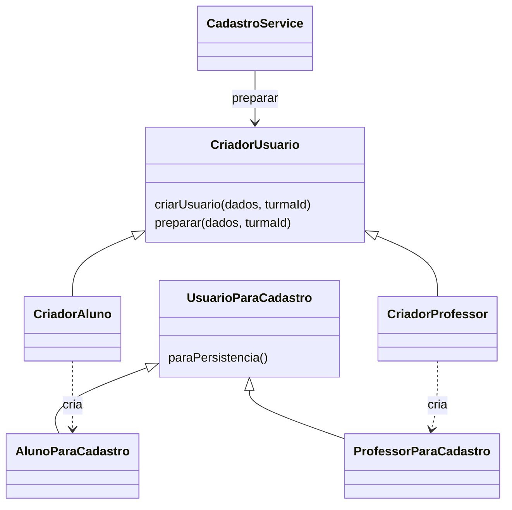

# Problema 4 — Factory Method na criação de usuários

Complemento da questão 2. Jornada Verde, 06 set. 2026.

## 1 Problema identificado

CadastroService possuía duas chamadas a `prisma.usuario.create`, duas configurações iguais de campos públicos de retorno e dois blocos de tratamento de e-mail duplicado. Os dados comuns de aluno e professor eram montados separadamente. A diferença relevante era o vínculo do aluno com uma turma validada.

## 2 Responsabilidades e padrão escolhido

Foi aplicado **Factory Method** à criação do objeto que fornece os dados para persistência. Conforme Refactoring.Guru ([s.d.]), o criador declara uma operação de criação e subclasses determinam o produto concreto, mantendo uma interface comum.

| Papel | Implementação |
| :--- | :--- |
| Produto comum | `UsuarioParaCadastro`, com `paraPersistencia()` |
| Produtos concretos | `AlunoParaCadastro` e `ProfessorParaCadastro` |
| Criador abstrato | `CriadorUsuario` |
| Factory Method | `criarUsuario(dados, turmaId?)` |
| Criadores concretos | `CriadorAluno` e `CriadorProfessor` |
| Operação que usa o produto | `CriadorUsuario.preparar()` |
| Cliente | `CadastroService`, que utiliza o criador configurado para o perfil |

Não se trata apenas de uma função com um if chamada de fábrica: existe sobrescrita do método de criação e produtos concretos distintos. O mapa de criadores por perfil, montado na composição, seleciona qual criador será usado; esse mapa não é, isoladamente, o padrão.

Os campos nome, e-mail e hash são mapeados uma única vez na base do produto. O aluno acrescenta perfil e conexão com turma; o professor acrescenta seu perfil. O serviço permanece responsável por validação do cadastro, hash, busca de turma e persistência. O produto não consulta o banco nem recebe a senha em texto puro nesse fluxo.



O custo é uma hierarquia adicional. Para apenas duas variações simples, uma extração de função com dados comuns seria menor; a escolha explícita de Factory Method atende ao exercício e fornece um ponto de extensão verificável. Adicionar novo perfil ainda exigirá regras, registro no mapa, tipos e testes: o padrão não elimina esse trabalho.

## 3 Fluxo refatorado

1. Validar presença/tamanho da senha e perfil.
2. Gerar hash com o componente de senhas injetado, mantendo bcrypt com 10 rounds na composição real.
3. Para aluno, verificar código e existência da turma.
4. Solicitar ao criador correspondente o payload de persistência.
5. Executar **uma única chamada de criação**, com **uma única seleção de campos públicos**.
6. Tratar P2002 em **um único catch**, propagando os demais erros.

| Elemento duplicado em cadastrar | Antes | Depois |
| :--- | :---: | :---: |
| Chamadas de criação de usuário | 2 | 1 |
| Configurações de seleção dos campos públicos | 2 | 1 |
| Blocos de tradução de P2002 | 2 | 1 |
| Mapeamento explícito dos campos comuns no payload | 2 | 1, na base do produto |

## 4 Comportamento preservado e correção explícita

Foram preservados os dados persistidos para os perfis válidos, normalização de maiúsculas/minúsculas do perfil, vínculo com turma, hash antes da gravação, campos retornados e mensagens de senha, turma e e-mail duplicado. Login permanece retornando somente dados públicos.

**Correção funcional adicional:** perfil desconhecido, vazio ou ausente agora é recusado com 422 antes de gerar hash ou persistir. Antes, valores diferentes de Aluno podiam seguir pelo caminho de professor, e perfil ausente podia causar erro de execução. Essa mudança é documentada separadamente da refatoração estrutural.

Esta alteração não verifica se um usuário é realmente professor e não implementa aprovação institucional. Também não acrescenta validação completa de nome/e-mail ou recuperação de senha. O planejamento B2B permanece separado.

## 5 Testes e resultados

Arquivo: `backend/tests/dependencias-cadastro.test.cjs`.

O snapshot `backend/tests/fixtures/problemas-3-4/CadastroService.ts.txt` permite executar o serviço anterior com as mesmas dependências simuladas. Os quatro cenários de perfis válidos comparam retorno e chamadas realizadas, incluindo payload, seleção, hash e busca de turma. Quatro cenários comparam as falhas anteriores de senha e turma. Há testes de P2002 para os dois perfis, erro de infraestrutura sem retry, perfis inválidos, login e tipos concretos produzidos pelo Factory Method.

O mock da persistência aplica a seleção recebida ao registro simulado. Os testes verificam explicitamente que o select não inclui senha e que o payload utiliza o hash fornecido pelo colaborador de senhas. Eles não testam o algoritmo bcrypt real.

Resultado conjunto com o problema 3 e a regressão do problema 1: **37 aprovados, 0 falhas**. Distribuição: 10 de criação de desafios, 18 de cadastro/login/fábricas e 9 de controllers/composição/rotas. A checagem de tipos do backend também passou.

```sh
node --experimental-vm-modules --test backend/tests/criacao-desafio.test.cjs backend/tests/dependencias-cadastro.test.cjs
```

Os testes rodam em Node 24.19.0 com carregamento experimental de módulos TypeScript, sem PostgreSQL, Redis ou porta HTTP real. A compilação foi verificada com TypeScript 6.0.3 e Prisma Client 5.22.0. Não foram executados testes de banco real ou do aplicativo nesta etapa. Consulte o relatório do problema 3 para reprodução da checagem de tipos e detalhes do ambiente.

## 6 Melhoria demonstrada

Mudanças nos campos comuns, na seleção de dados públicos ou na tradução do erro de duplicidade possuem um único ponto de manutenção. As variações de produto são exercitadas isoladamente e o serviço pode usar banco e hash simulados por injeção. Não se afirma ganho de desempenho; a melhoria demonstrada é estrutural e de testabilidade.

Este conteúdo complementa o trabalho acadêmico existente. Não substitui a revisão de diagramação ABNT da entrega final.

## Referência

REFACTORING.GURU. **Factory Method**. [S. l.], [s.d.]. Disponível em: https://refactoring.guru/design-patterns/factory-method. Acesso em: 6 set. 2026.

## Apêndice — Código antes e depois

Os trechos seguintes são extraídos dos arquivos do projeto. O snapshot mantém o código anterior integral.

### Antes: CadastroService

```typescript
import { prisma } from '../../database/prismaClient';
import bcrypt from 'bcrypt';

// Criamos uma interface para definir exatamente quais dados o serviço espera receber
interface DadosCadastro {
  nome: string;
  email: string;
  senha?: string; // opcional temporariamente para checagem se necessário
  perfil: 'Professor' | 'Aluno';
  codigoTurma?: string;
}

export class CadastroService {
  async login(email: string, senhaDigitada: string) {
    // 1. Busca o usuário pelo e-mail informado
    const usuario = await prisma.usuario.findUnique({
      where: { email }
    });

    // 2. Se não achar o usuário, lança um erro 401 (Não Autorizado)
    // Usamos uma mensagem genérica por segurança para evitar que invasores descubram e-mails válidos
    if (!usuario) {
      const erro: any = new Error('E-mail ou senha inválidos.');
      erro.statusCode = 401;
      throw erro;
    }

    // 3. Compara a senha digitada com o hash criptografado salvo no banco
    const senhaValida = await bcrypt.compare(senhaDigitada, usuario.senha);

    if (!senhaValida) {
      const erro: any = new Error('E-mail ou senha inválidos.');
      erro.statusCode = 401;
      throw erro;
    }

    // 4. Se a senha bater, retorna os dados do usuário mascarando a senha
    return {
      id: usuario.id,
      nome: usuario.nome,
      email: usuario.email,
      perfil: usuario.perfil
    };
  }
  async cadastrar({ nome, email, senha, perfil, codigoTurma }: DadosCadastro) {
    if (!senha) {
      throw new Error('A senha é obrigatória.');
    }

    if (senha.length < 8) {
      const erro: any = new Error('A senha deve ter no mínimo 8 caracteres.');
      erro.statusCode = 422;
      throw erro;
    }

    // Normaliza perfil para 'Aluno' ou 'Professor' (aceita entradas em minúsculas)
    const perfilNormalizado = perfil.charAt(0).toUpperCase() + perfil.slice(1).toLowerCase();

    // 1. Criptografar a senha com o bcrypt (10 rounds de salt é o padrão seguro)
    const senhaHash = await bcrypt.hash(senha, 10);

    // 2. Se o perfil for Aluno, precisamos validar a turma antes de criar o usuário
    if (perfilNormalizado === 'Aluno') {
      if (!codigoTurma) {
        // Retornamos um erro com um status customizado para o controller tratar como 422
        const erro: any = new Error('O código da turma é obrigatório para alunos.');
        erro.statusCode = 422;
        throw erro;
      }

      // Busca a turma no Postgres usando o Prisma pelo código de 6 caracteres
      const turmaExistente = await prisma.turma.findUnique({
        where: { codigo: codigoTurma }
      });

      // Se a turma não existir, barramos o cadastro aqui
      if (!turmaExistente) {
        const erro: any = new Error('Código de turma inválido.');
        erro.statusCode = 422;
        throw erro;
      }

      // Tenta criar o Aluno e já vincula ele na turma na mesma operação
      try {
        const novoAluno = await prisma.usuario.create({
          data: {
            nome,
            email,
            senha: senhaHash,
            perfil: perfilNormalizado,
            turmas: {
              connect: { id: turmaExistente.id } // Conecta o aluno na tabela de relação N:M
            }
          },
          select: { id: true, nome: true, email: true, perfil: true, criadoEm: true }
        });

        return novoAluno;
      } catch (error: any) {
        // Captura o erro de campo único (@unique) do Prisma para e-mail duplicado
        if (error.code === 'P2002') {
          const erro: any = new Error('Este e-mail já está cadastrado.');
          erro.statusCode = 400;
          throw erro;
        }
        throw error;
      }
    }

    // 3. Se o perfil for Professor, cria direto sem precisar de código de turma
    try {
      const novoProfessor = await prisma.usuario.create({
        data: {
          nome,
          email,
          senha: senhaHash,
          perfil: perfilNormalizado
        },
        // O select evita que a senha volte na resposta por segurança
        select: { id: true, nome: true, email: true, perfil: true, criadoEm: true }
      });

      return novoProfessor;
    } catch (error: any) {
      if (error.code === 'P2002') {
        const erro: any = new Error('Este e-mail já está cadastrado.');
        erro.statusCode = 400;
        throw erro;
      }
      throw error;
    }
  }
}
```

### Depois: CadastroService

```typescript
import type { PrismaClient } from '@prisma/client';
import type { CriadorUsuario } from '../factories/CriadorUsuario';
export interface DadosCadastro {
    nome: string;
    email: string;
    senha?: string;
    perfil: string;
    codigoTurma?: string;
}
export interface Senhas {
    hash(senha: string, rounds: number): Promise<string>;
    compare(senha: string, hash: string): Promise<boolean>;
}
export interface DependenciasCadastro {
    db: Pick<PrismaClient, 'usuario' | 'turma'>;
    senhas: Senhas;
    criadores: Readonly<Record<'Aluno' | 'Professor', CriadorUsuario>>;
}
const camposPublicos = { id: true, nome: true, email: true, perfil: true, criadoEm: true } as const;
export class CadastroService {
    private readonly deps: DependenciasCadastro;
    constructor(deps: DependenciasCadastro) { this.deps = deps; }
    async login(email: string, senhaDigitada: string) {
        const usuario = await this.deps.db.usuario.findUnique({ where: { email } });
        if (!usuario || !await this.deps.senhas.compare(senhaDigitada, usuario.senha)) {
            throw Object.assign(new Error('E-mail ou senha inválidos.'), { statusCode: 401 });
        }
        return { id: usuario.id, nome: usuario.nome, email: usuario.email, perfil: usuario.perfil };
    }
    async cadastrar({ nome, email, senha, perfil, codigoTurma }: DadosCadastro) {
        if (!senha)
            throw new Error('A senha é obrigatória.');
        if (senha.length < 8) {
            throw Object.assign(new Error('A senha deve ter no mínimo 8 caracteres.'), { statusCode: 422 });
        }
        const perfilNormalizado = typeof perfil === 'string'
            ? perfil.charAt(0).toUpperCase() + perfil.slice(1).toLowerCase() : '';
        // Correção explícita: antes qualquer perfil diferente de Aluno era persistido.
        if (perfilNormalizado !== 'Aluno' && perfilNormalizado !== 'Professor') {
            throw Object.assign(new Error('Perfil inválido. Selecione Aluno ou Professor.'), { statusCode: 422 });
        }
        const senhaHash = await this.deps.senhas.hash(senha, 10);
        let turmaId: string | undefined;
        if (perfilNormalizado === 'Aluno') {
            if (!codigoTurma) {
                throw Object.assign(new Error('O código da turma é obrigatório para alunos.'), { statusCode: 422 });
            }
            const turma = await this.deps.db.turma.findUnique({ where: { codigo: codigoTurma } });
            if (!turma)
                throw Object.assign(new Error('Código de turma inválido.'), { statusCode: 422 });
            turmaId = turma.id;
        }
        const data = this.deps.criadores[perfilNormalizado].preparar({ nome, email, senha: senhaHash }, turmaId);
        try {
            return await this.deps.db.usuario.create({ data, select: camposPublicos });
        }
        catch (error: unknown) {
            if (typeof error === 'object' && error !== null && 'code' in error && error.code === 'P2002') {
                throw Object.assign(new Error('Este e-mail já está cadastrado.'), { statusCode: 400 });
            }
            throw error;
        }
    }
}
```

### Depois: criadores e produtos

```typescript
export interface DadosBaseUsuario {
    nome: string;
    email: string;
    senha: string;
}
export interface PayloadUsuario extends DadosBaseUsuario {
    perfil: 'Aluno' | 'Professor';
    turmas?: {
        connect: {
            id: string;
        };
    };
}
// Produto comum. O mapeamento dos campos compartilhados existe uma única vez.
export abstract class UsuarioParaCadastro {
    protected readonly dados: DadosBaseUsuario;
    constructor(dados: DadosBaseUsuario) { this.dados = dados; }
    protected abstract especificos(): Pick<PayloadUsuario, 'perfil' | 'turmas'>;
    paraPersistencia(): PayloadUsuario {
        return {
            nome: this.dados.nome,
            email: this.dados.email,
            senha: this.dados.senha,
            ...this.especificos(),
        };
    }
}
export class AlunoParaCadastro extends UsuarioParaCadastro {
    private readonly turmaId: string;
    constructor(dados: DadosBaseUsuario, turmaId: string) {
        super(dados);
        this.turmaId = turmaId;
    }
    protected especificos(): Pick<PayloadUsuario, 'perfil' | 'turmas'> {
        return { perfil: 'Aluno', turmas: { connect: { id: this.turmaId } } };
    }
}
export class ProfessorParaCadastro extends UsuarioParaCadastro {
    protected especificos(): Pick<PayloadUsuario, 'perfil' | 'turmas'> {
        return { perfil: 'Professor' };
    }
}
export abstract class CriadorUsuario {
    // Factory Method: subclasses decidem qual produto concreto construir.
    abstract criarUsuario(dados: DadosBaseUsuario, turmaId?: string): UsuarioParaCadastro;
    preparar(dados: DadosBaseUsuario, turmaId?: string): PayloadUsuario {
        return this.criarUsuario(dados, turmaId).paraPersistencia();
    }
}
export class CriadorAluno extends CriadorUsuario {
    criarUsuario(dados: DadosBaseUsuario, turmaId?: string): UsuarioParaCadastro {
        if (!turmaId)
            throw new Error('Uma turma validada é necessária para criar aluno.');
        return new AlunoParaCadastro(dados, turmaId);
    }
}
export class CriadorProfessor extends CriadorUsuario {
    criarUsuario(dados: DadosBaseUsuario): UsuarioParaCadastro {
        return new ProfessorParaCadastro(dados);
    }
}
```
