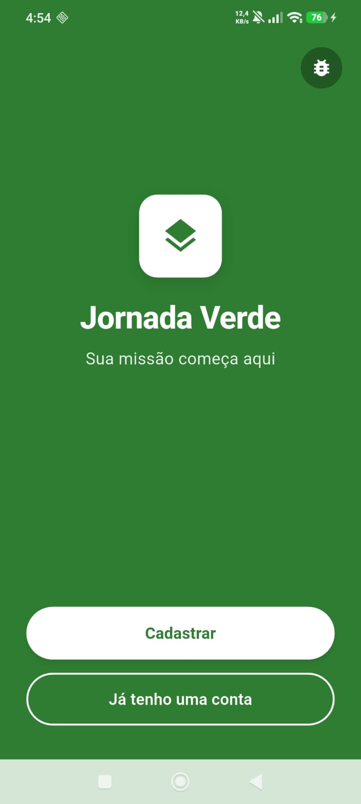
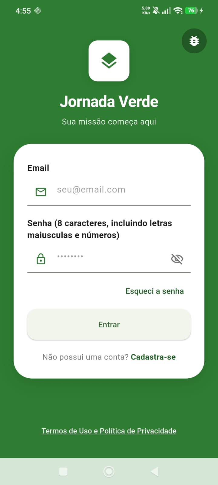
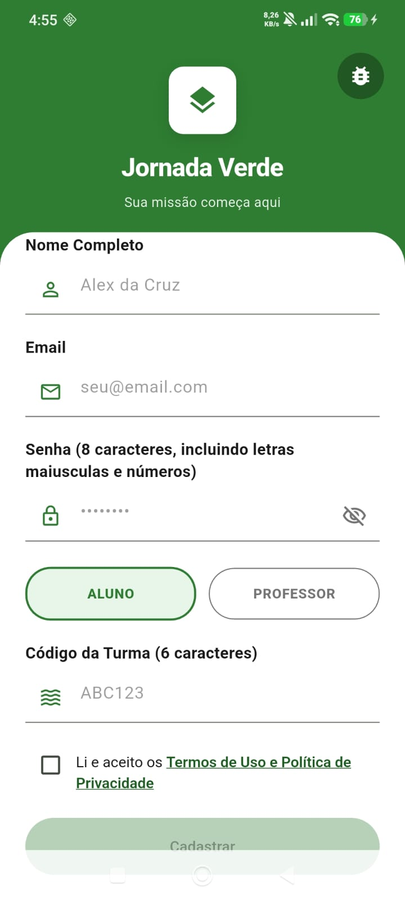
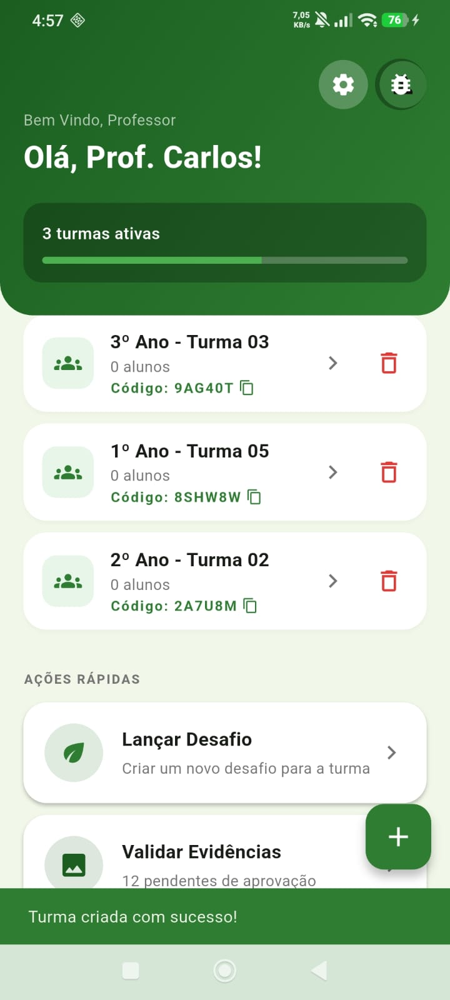
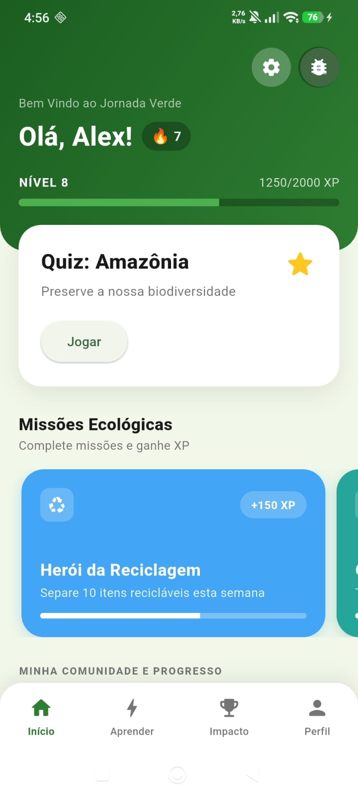
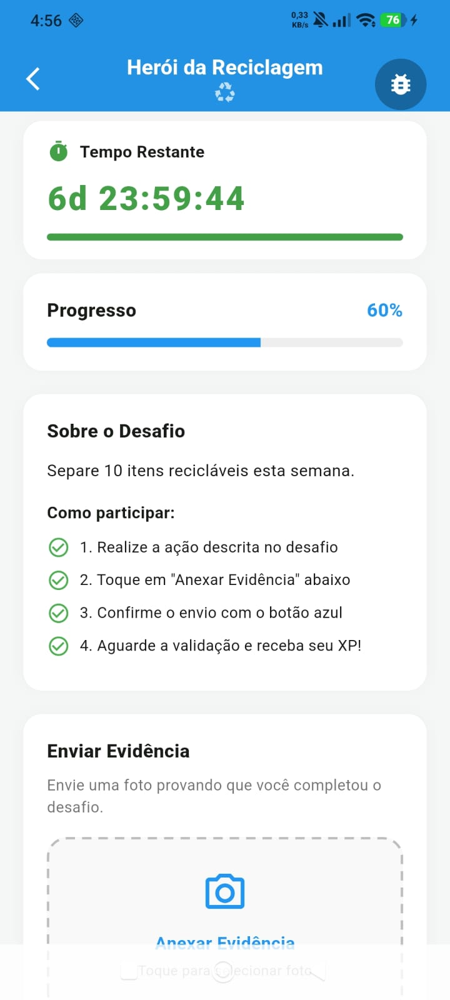
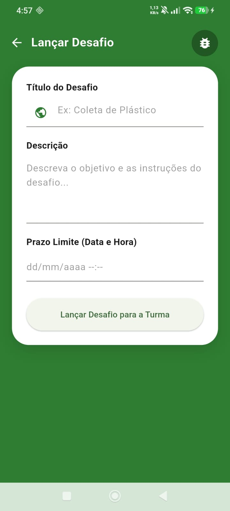
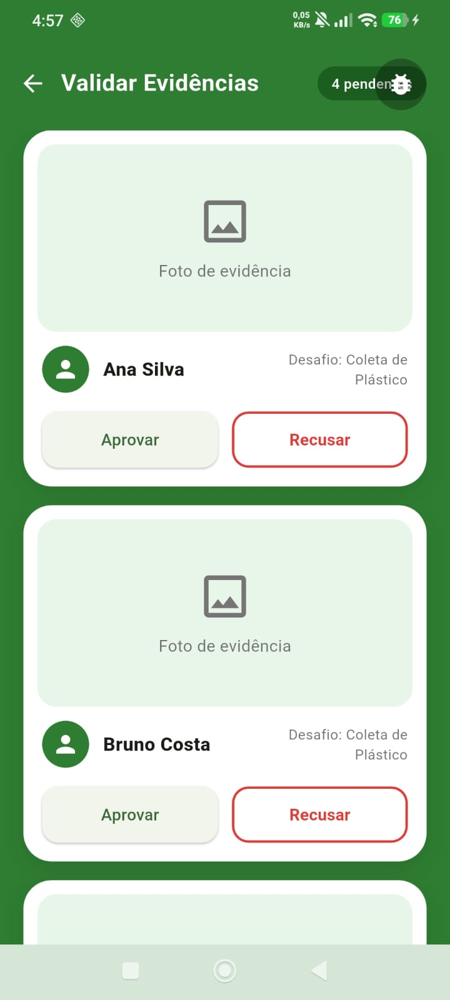
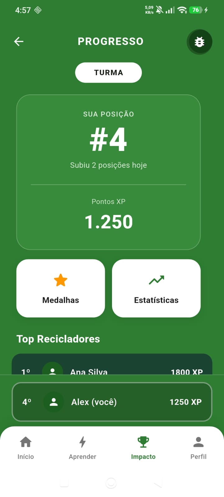
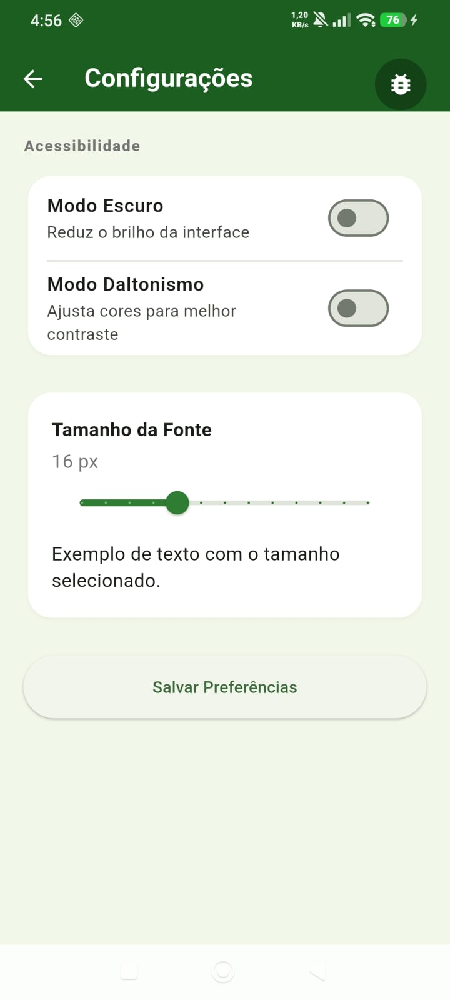

# Matriz de Rastreabilidade

Este documento apresenta a rastreabilidade de requisitos do projeto Jornada Verde. O objetivo desta seção é estabelecer a relação direta e transparente entre o que foi planejado no backlog e o que foi efetivamente construído no aplicativo.

Abaixo, apresentamos o mapeamento detalhado das interfaces do sistema. Para cada tela desenvolvida, listamos as **Histórias de Usuário (US)** correspondentes e descrevemos brevemente como os critérios de aceitação e as regras de negócio foram implementados na prática. Isso garante o alinhamento total entre o escopo inicial e o produto final.

---

## Tela 1 — Boas-vindas

**[US13 (#68)](https://github.com/Rhodgs/projeto-pratico-es/issues/68):** Enquanto usuário, desejo realizar cadastro básico no sistema criando um perfil para salvar meu progresso na Jornada Verde.

  
  
<em>Figura 1: Tela inicial do aplicativo Jornada Verde, com botões de acesso ao cadastro e login.</em>

**Implementação no MVP:** A funcionalidade foi implementada por meio da tela de boas-vindas (`welcome_screen.dart`), que serve como ponto de entrada do aplicativo. O usuário visualiza o nome e logo do sistema e pode escolher entre dois fluxos: "Cadastrar" (novo usuário) ou "Já tenho uma conta" (usuário existente), direcionando corretamente para o cadastro ou login.

---

## Tela 2 — Login

**[US13 (#68)](https://github.com/Rhodgs/projeto-pratico-es/issues/68):** Enquanto usuário, desejo realizar cadastro básico no sistema criando um perfil para salvar meu progresso na Jornada Verde.

  
  
<em>Figura 2: Tela de autenticação com campos de e-mail e senha, opção de recuperação de senha e link para cadastro.</em>

**Implementação no MVP:** A funcionalidade foi implementada na tela de login (`login_screen.dart`), onde o usuário insere e-mail e senha para autenticação. O campo de senha exige mínimo de 8 caracteres com letras maiúsculas e números. A tela também oferece a opção "Esqueci a senha" e link para cadastro de novos usuários.

---

## Tela 3 — Cadastro

**[US13 (#68)](https://github.com/Rhodgs/projeto-pratico-es/issues/68):** Enquanto usuário, desejo realizar cadastro básico no sistema criando um perfil para salvar meu progresso na Jornada Verde.

  
  
<em>Figura 3: Tela de cadastro com campos de nome, e-mail, senha, seleção de perfil (Aluno/Professor) e código da turma.</em>

**Implementação no MVP:** A funcionalidade foi implementada na tela de cadastro (`register_screen.dart`), onde o usuário preenche Nome Completo, E-mail, Senha (mínimo 8 caracteres com letras maiúsculas e números) e seleciona seu perfil (Aluno ou Professor). Alunos também informam o Código da Turma (6 caracteres) para ingresso na turma do professor. O sistema impede o registro de dois usuários com o mesmo e-mail.

---

## Tela 4 — Dashboard do Professor

**[US3 (#59)](https://github.com/Rhodgs/projeto-pratico-es/issues/59):** Enquanto professor, desejo criar "turmas" dentro do aplicativo para gerenciar meus alunos de forma organizada.

  
  
<em>Figura 4: Dashboard do professor exibindo lista de turmas ativas com códigos alfanuméricos e ações rápidas de gerenciamento.</em>

**Implementação no MVP:** A funcionalidade foi implementada na tela de dashboard do professor (`teacher_dashboard_screen.dart`), que exibe a lista de turmas ativas com nome, número de alunos e código alfanumérico de 6 caracteres (ex: 9AG40T) com botão de copiar. O professor pode excluir turmas e acessar ações rápidas como "Lançar Desafio" e "Validar Evidências". O sistema exibe o total de turmas ativas e notifica sobre evidências pendentes de aprovação.

---

## Tela 5 — Dashboard do Aluno

**[US1 (#57)](https://github.com/Rhodgs/projeto-pratico-es/issues/57):** Enquanto estudante, desejo manter uma sequência de dias ativos (ofensiva) para que eu me sinta motivado a interagir com o aplicativo diariamente.  
**[US4 (#60)](https://github.com/Rhodgs/projeto-pratico-es/issues/60):** Como professor, desejo lançar desafios práticos para que os alunos interajam com a atividade e enviem suas evidências dentro do prazo.

  
  
<em>Figura 5: Dashboard do aluno com contador de ofensiva diária, barra de XP, nível atual e lista de missões ecológicas disponíveis.</em>

**Implementação no MVP:** A funcionalidade foi implementada na tela de dashboard do aluno (`student_dashboard_screen.dart`), que exibe o contador de ofensiva (ícone 🔥 com número de dias seguidos), nível e barra de progresso de XP (ex: Nível 8, 1250/2000 XP). A tela também lista as Missões Ecológicas disponíveis com título, descrição e XP de recompensa (+150 XP), permitindo que o aluno acesse os desafios lançados pelo professor.

---

## Tela 6 — Desafio do Aluno (Upload de Evidência)

**[US4 (#60)](https://github.com/Rhodgs/projeto-pratico-es/issues/60):** Como professor, desejo lançar desafios práticos permitindo que os alunos interajam com a atividade e enviem suas evidências dentro do prazo para validação.

  
  
<em>Figura 6: Tela de execução do desafio pelo aluno, com cronômetro regressivo, barra de progresso e área para anexar evidência fotográfica.</em>

**Implementação no MVP:** A funcionalidade foi implementada na tela de upload de evidência (`challenge_upload_screen.dart`). A tela exibe a descrição do desafio, um cronômetro regressivo com o tempo restante (ex: 6d 23:59:44) que muda de cor conforme o prazo se aproxima, e uma barra de progresso. O aluno pode tocar na área pontilhada para simular o anexo de uma foto (toggle visual, MVP sem banco de imagens real) e enviar a evidência pelo botão azul.

---

## Tela 7 — Lançar Desafio (Professor)

**[US4 (#60)](https://github.com/Rhodgs/projeto-pratico-es/issues/60):** Como professor, desejo lançar desafios práticos para tirar as aulas da teoria e focar em causas reais.

  
  
<em>Figura 7: Tela de criação de desafio pelo professor, com campos de título, descrição e prazo limite com data e hora.</em>

**Implementação no MVP:** A funcionalidade foi implementada na tela de lançamento de desafio (`teacher_launch_challenge_screen.dart`). O professor preenche o Título do Desafio, uma Descrição com objetivo e instruções, e define o Prazo Limite com data e hora. Ao confirmar, o desafio é enviado via `POST /api/desafios` e fica disponível para os alunos da turma, ativando automaticamente o cronômetro regressivo na tela do aluno.

---

## Tela 8 — Validar Evidências (Professor)

**[US11 (#66)](https://github.com/Rhodgs/projeto-pratico-es/issues/66):** Enquanto professor, desejo validar as evidências enviadas pelos alunos para garantir que as missões práticas foram cumpridas corretamente.

  
  
<em>Figura 8: Tela de validação de evidências com lista de envios pendentes, foto do aluno e botões de aprovação e recusa.</em>

**Implementação no MVP:** A funcionalidade foi implementada na tela de validação (`teacher_validation_screen.dart`). O professor visualiza uma lista de evidências pendentes, com a foto enviada pelo aluno, nome do aluno e desafio associado. Cada item possui botões "Aprovar" e "Recusar" com cores semânticas. O contador no topo exibe o total de pendências. A pontuação só é atribuída ao aluno após a aprovação manual do professor.

---

## Tela 9 — Progresso e Ranking

**[US2 (#58)](https://github.com/Rhodgs/projeto-pratico-es/issues/58):** Enquanto estudante, desejo visualizar um ranking escolar com atualizações imediatas após a classificação para competir de forma saudável com meus amigos.

  
  
<em>Figura 9: Tela de progresso e ranking da turma, com posição atual do usuário em destaque, pontuação em XP e lista dos Top Recicladores.</em>

**Implementação no MVP:** A funcionalidade foi implementada na tela de progresso (`progress_ranking_screen.dart`). A tela exibe a posição atual do usuário em destaque (ex: #4, com mensagem "Subiu 2 posições hoje") e sua pontuação em XP formatada (1.250). Abaixo, o Top Recicladores lista os alunos com maior XP da turma. A posição do usuário logado fica fixada na parte inferior da tela, mesmo quando não está no top, atendendo ao CA04 da US2.

---

## Tela 10 — Configurações / Acessibilidade

**[US6 (#62)](https://github.com/Rhodgs/projeto-pratico-es/issues/62):** Enquanto usuário com baixa visão, desejo configurar recursos de acessibilidade visual para facilitar a navegação e o consumo de conteúdo na plataforma.

  
  
<em>Figura 10: Tela de configurações de acessibilidade com toggles de Modo Escuro e Daltonismo e slider de tamanho de fonte com preview em tempo real.</em>

**Implementação no MVP:** A funcionalidade foi implementada na tela de acessibilidade (`accessibility_screen.dart`). O usuário pode ativar o Modo Escuro e o Modo Daltonismo por meio de toggles, e ajustar o tamanho da fonte com um slider (com preview em tempo real do texto). As preferências são salvas via `PUT /api/usuario/preferencias` e persistidas no perfil do usuário, sendo aplicadas globalmente no app sem necessidade de reiniciar.
